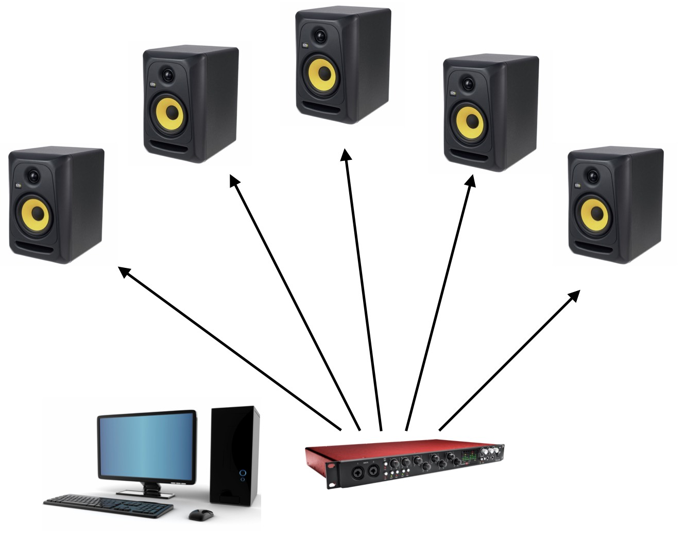
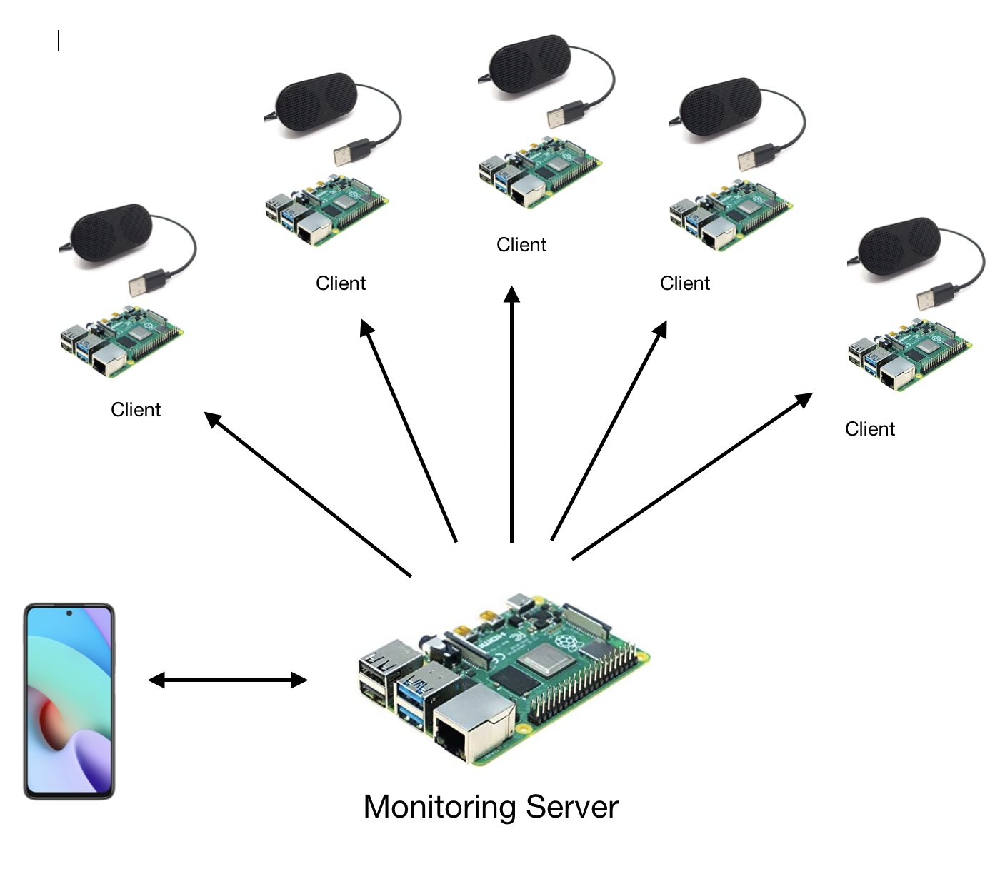

Audio Spatializer IOT System
============================

The goal of this project is to create a low-cost system to generate sounds (synthetic and recorded) from several speakers for the ZG6 project.

Description
-----------

Current Platform
++++++++++++++++

Currently, the ZG6 sound test platform is composed of:

* A web-based software to control the sounds (https://zg6.s3.eu-west-3.amazonaws.com/index.html)
* An usb soundcard with multiple outputs (scarlett focusrite), 
* 5 KRK speakers,
* 5 audio jacks

The above setup costs approximately 1500 euros and requires a laptop or a PC with appropriate driver

Proposed Alternative
++++++++++++++++++++

In this project, we propose to replace the current platform by the following system 

* A laptop or a mobile phone device,
* A server application (Backend Flask / Django, Frontend Vue) hosted on a raspberry Pi,
* 5 raspberry Pi (or Pi zero) connected to low-cost audio speakers,
* (A network switch).

Methodology
-----------

* Step 1: Play wav files using the raspberry py with usb sound speaker (play/stop, looping, volume control),
* Step 2: Send messages from the master raspberry to the client raspberry using Ethernet or Wifi. The messages should control the client audio activity. 
* Step 3: Create a web application on the master raspberry to control the audio activity