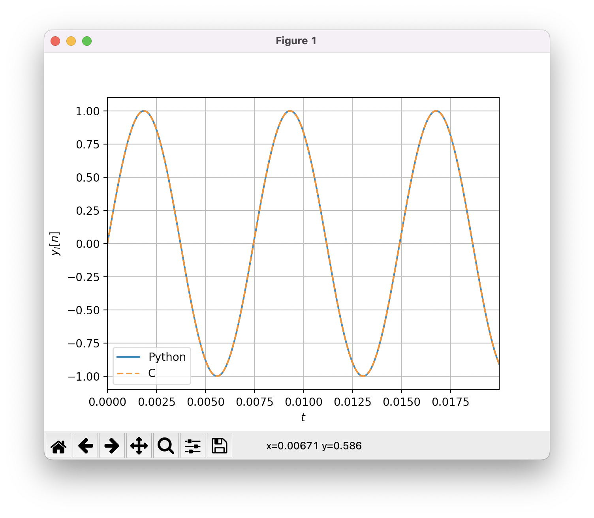

Digital Oscillators
===================

In this tutorial, we shows how to generate a digital waveform using a lookup table.
Specifically, we focus on the generation of a sine waveform, but this tutorial can be easily extended to 
other waveforms such as triangle or sawtooth waveforms.

Sine Wave Waveform 
------------------

A sine wave is mathematically described by :

.. math ::

    x(t) = \sin(2\pi f_0 t)

* :math:`f_0` corresponds to the fundamental frequency. 

In the digital domain, the sine wave can be obtained by evaluating :math:`x(t)` for :math:`t=n/f_s` where :math:`n \in \mathbb{N}` and :math:`f_s` is the sampling frequency.

When using the C language, the function :math:`x[n]=x(n/fs)` can be evaluated 
naively using the :code:`sin` function of the library :code:`math.h`. Nevertheless, it is important to note that the evaluation of trigonometric functions 
has a relatively large computational cost. In this tutorial, we describe an alternative low-complexity implementation based on a wavetable oscillator.

Wavetable Oscillator
--------------------

To reduce the computational complexity, one solution is to store in memory a single full cycle of a reference waveform.
For a sine wave, the reference waveform is given by :

.. math ::

    x[n] = \sin(2\pi n/N)

* :math:`N` corresponds to the length of the wavetable.

.. plot :: 
    :include-source: false

    import numpy as np 
    import matplotlib.pyplot as plt

    from scipy import signal

    N = 128
    n = np.arange(N)
    x = np.sin(2*np.pi*n/N)     
    plt.stem(n, x)
    plt.grid()
    plt.xlabel("$n$")
    plt.ylabel("$x[n]$")
    plt.xlim([0, N-1])

The fundamental frequency of this waveform depends on the sampling frequency :code:`f_s`. By reading each sample 
of the wavetable sample by sample, we can synthesize a periodic waveform with a fixed fundamental frequency :

.. math ::
    
    f_{0}=N/f_s~~[Hz]. 

Controlling the Fundamental Frequency
-------------------------------------

Instead of generating a periodic signal with a fixed frequency, a synthesizer must be able to generate a periodic signal with a
time varying frequencies :math:`f_{0}`. In this subsection, we shows how to modify the rate at which the samples are read in the wavetable to control the 
frequency :math:`f_{0}` of the waveform.

Let us denote by :math:`y[n]` the :math:`n^{th}` output sample and let us consider that :math:`y[n] = x[m]`.
To synthesize a waveform with fundamental frequency :math:`f_{0}`, the next output sample can be expressed by :

.. math ::

    y[n+1] = x[m+\Delta]

* :math:`\Delta=N\frac{f_0}{f_s}` corresponds to the phase delta (increment) between two adjacent samples.

In the above expression, the next index :math:`k=m+\Delta` is not always an integer as illustrated in the above figure. To obtain the value of :math:`x[k]`, two solutions are commonly used.

.. plot :: 
    :include-source: false

    import numpy as np 
    import matplotlib.pyplot as plt

    from scipy import signal

    N = 128
    n = np.arange(N)
    x = np.sin(2*np.pi*n/N)     
    plt.stem(n, x)
    plt.axvline(22.75, color="r", linestyle="--")
    plt.text(22.7, -0.1, 'k', color="r")
    plt.grid()
    plt.xlabel("$n$")
    plt.ylabel("$x[n]$")
    plt.xlim([20.5, 25.5])
    plt.ylim([0, 1])

Zero order Interpolation 
++++++++++++++++++++++++

When the index :math:`k` is not an integer, a simple solution is to truncate the value of :math:`k` to the greatest integer less than or equal to :math:`k`. Specifically, we can 
Mathematically, the next output sample is then given by :

.. math ::

    y[n+1] = x[\lfloor k \rfloor]

* :math:`\lfloor . \rfloor` corresponds to the rounding operator. For example, :math:`\lfloor 3.21 \rfloor=3` and :math:`\lfloor 5.98 \rfloor=5`. 

Linear Interpolation
++++++++++++++++++++

To improve the oscillator quality, another solution is to estimate the value of :math:`y[n+1]` from the two nearest samples using an interpolation algorithm.
Using a linear interpolation, the next output sample can be expressed as :

.. math ::

    y[n+1] = x_l + \alpha (x_r-x_l)

* :math:`\alpha = k-\lfloor k \rfloor` is a weighting coefficient (:math:`0\le \alpha<1`),
* :math:`x_l=x[\lfloor k \rfloor]` and :math:`x_r = x[\lfloor k \rfloor+1]` corresponds to two adjacent samples.

C Implementation 
----------------

The following code shows a possible C implementation for the wavetable synthesizer. 

.. code :: c

    void oscillator(double *buffer, double f0, int fs, double *currentIndex, int size)
    {
        double coef;
        float index = *currentIndex;
        float delta = N*(f0/(1.0*fs));
        int index_l, index_r;
        int n;

        for(n=0; n<size; n++)
        {
            index_l = (int)index;
            index_r = (index_l == (N-1)) ? 0 : index_l+1;
            coef = index - index_l;
            buffer[n] = wavetable[index_l]+ coef*(wavetable[index_r]-wavetable[index_l]);
            //update increment
            index += delta;
            if (index > N) 
            {
                index -= N;
            }
        }
        *currentIndex = index; //export index
    }

Verification 
------------

I recommend to check the validity of the C code by comparing the output of the C and Python implementation.

* First, compile the C code as a shared library 

.. code ::

    $ gcc -fPIC -shared my_lib.c -o my_lib.so 

* Then, run the following python code.

.. code ::

    import ctypes
    import numpy as np
    from numpy.ctypeslib import ndpointer
    import matplotlib.pyplot as plt
    from scipy import signal

    # import C function
    lib = ctypes.cdll.LoadLibrary("./my_lib.so")
    oscillator = lib.oscillator
    oscillator.restype = None
    oscillator.argtypes = [ndpointer(ctypes.c_double, flags="C_CONTIGUOUS"),
                    ctypes.c_double,
                    ctypes.c_size_t,
                    ctypes.POINTER(ctypes.c_double),
                    ctypes.c_size_t]

    # parameter
    fs = 44100
    f0 = 134.23

    # create oscillator
    t = np.arange(0, 0.02, 1/fs)
    x = np.sin(2*np.pi*f0*t)

    # allocate arguments and call the C function
    N = len(t)
    y = np.zeros(N)
    currentIndex = ctypes.c_double(0.0)
    oscillator(y, f0, fs, ctypes.pointer(currentIndex), N)

    # plot the result
    plt.plot(t, x, label="Python")
    plt.plot(t, y, "--", label="C")
    plt.grid()
    plt.xlabel("$t$")
    plt.ylabel("$y_l[n]$")
    plt.xlim([0,t[-1]])
    plt.legend()
    plt.show()

References
----------

* JUCE C++ implementation: https://docs.juce.com/master/tutorial_wavetable_synth.html