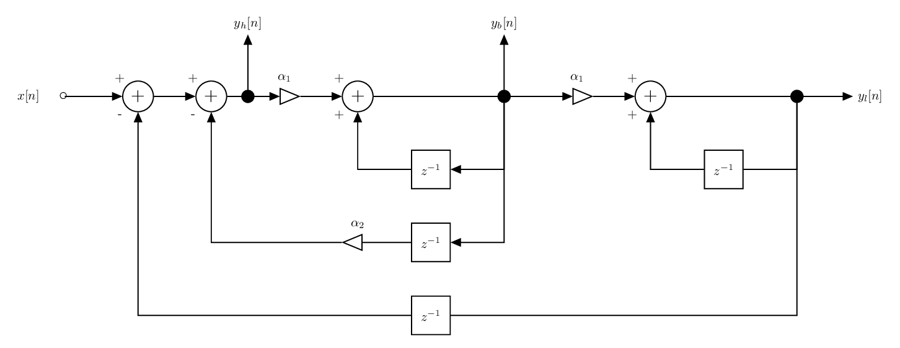
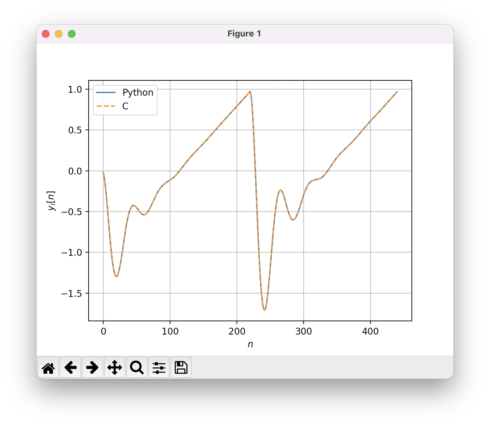

Digital State Variable Filter
=============================

In this tutorial, we show how to implement a parametric IIR filter. Specifically, we focus on the implementation 
of a digital state variable filter. 

Filter Structure 
----------------

The structure of the digital state variable filter is provided below.

The state variable filter has 1 input and 3 outputs. Each output corresponds to a particular filter type:

* :math:`y_h[n]`: high pass filter, 
* :math:`y_b[n]`: band pass filter, 
* :math:`y_l[n]`: low pass filter.

The state variable filter depends on the parameters :math:`\alpha_1` and :math:`\alpha_2`. These two parameters are directly
linked to the frequency characteristics of the filter. Specifically:

* :math:`\alpha_1=2\sin(\pi f_c/F_s)`: where :math:`f_c` is the cut-off frequency and :math:`F_s` is the sampling frequency,
* :math:`\alpha_2=1/Q`: where :math:`Q` is the Q factor.

Analysis of the Low Pass Filter 
-------------------------------

Difference equation
+++++++++++++++++++

The low pass filter can be described by the difference equation :

.. math ::

    y_l[n] = \alpha_1^2x[n] -a_1 y_l[n-1] -a_2 y_l[n-2]

where :math:`a_1=\alpha_1^2+\alpha_1\alpha_2-2` and :math:`a_2=1-\alpha_1\alpha_2`.

Frequency Response
++++++++++++++++++

The following script plots the frequency response of the low-pass filter.

.. plot :: 
    :include-source: true

    import numpy as np 
    import matplotlib.pyplot as plt

    from scipy import signal

    fc = 5000
    fs = 44100
    Q = 2

    alpha1 = 2*np.sin(np.pi*fc/fs)
    alpha2 = 1/Q 

    b = [alpha1**2]
    a = [1, (alpha1**2+alpha1*alpha2-2), (1-alpha1*alpha2)]
    f, h = signal.freqz(b, a, fs=fs)
    plt.semilogy(f, abs(h))
    plt.axvline(fc,c="r")
    plt.grid()
    plt.xlabel("Frequency [Hz]")
    plt.ylabel("Modulus")
    plt.xlim([0, fs/2])

C Implementation
----------------

Block-based Implementation
++++++++++++++++++++++++++

The following code shows a possible C implementation of the state variable filter. This implementation 
uses a state array :code:`zi` that store the previous values of :math:`y_b[n-1]` and :math:`y_bl[n-1]`. This state 
array allows to pass the filter state from block to block.

.. code :: c

    #include <math.h>

    void state_variable_filter(double *buffer, double *zi, int size, double Q, double fc, int fs)
    {
        // This function applies a state variable filter to the data contained in a buffer *buffer
        // zi: [y_b[n-1], y_l[n-1]]
        int i;
        double alpha1 = 2.0*sin(M_PI*fc/(1.0*fs));
        double alpha2 = 1.0/Q;
        double y_h, y_b, y_l, x;

        for(i=0; i<size; i++){
            x = buffer[i];
            y_h = x - zi[1] - alpha2*zi[0];
            y_b = alpha1*y_h + zi[0];
            y_l = alpha1*y_b + zi[1];
            buffer[i] = y_l;

            //update states
            zi[0] = y_b;
            zi[1] = y_l;
        }
    }

Verification
++++++++++++

I recommend to check the validity of the C code by comparing the output of the C and Python implementation.

* First, compile the C code as a shared library 

.. code ::

    $ gcc -fPIC -shared my_lib.c -o my_lib.so 

* Then, in the same folder, run the following python code.

.. code ::
    
    import ctypes
    import numpy as np
    from numpy.ctypeslib import ndpointer
    import matplotlib.pyplot as plt
    from scipy import signal

    # import C function
    lib = ctypes.cdll.LoadLibrary("./my_lib.so")
    state_variable_filter = lib.state_variable_filter
    state_variable_filter.restype = None
    state_variable_filter.argtypes = [ndpointer(ctypes.c_double, flags="C_CONTIGUOUS"),
                    ndpointer(ctypes.c_double, flags="C_CONTIGUOUS"),
                    ctypes.c_size_t, 
                    ctypes.c_double,
                    ctypes.c_double,
                    ctypes.c_size_t
                    ]

    # parameter
    fs = 44100
    fc = 1000
    Q = 2

    # create oscillator
    t = np.arange(0, 0.01, 1/fs)
    x = signal.sawtooth(2*np.pi*200*t)

    # python code
    alpha1 = 2*np.sin(np.pi*fc/fs)
    alpha2 = 1/Q
    b = [alpha1**2]
    a = [1, alpha1**2+alpha1*alpha2-2, 1-alpha1*alpha2]
    y_out = signal.lfilter(b, a, x)

    # allocate arguments and call the C function
    N = len(t)
    zi = np.zeros(2)
    buffer = x
    state_variable_filter(buffer, zi, N, Q, fc, fs)

    # plot the result
    plt.plot(y_out, label="Python")
    plt.plot(buffer, "--", label="C")
    plt.grid()
    plt.xlabel("$n$")
    plt.ylabel("$y_l[n]$")
    plt.legend()
    plt.show()

References
----------

* JUCE C++ implementation: https://github.com/juce-framework/JUCE/blob/master/modules/juce_dsp/processors/juce_StateVariableFilter.h
* Zolzer, DAFX: Digital Audio Effects, http://www.music.mcgill.ca/~ich/classes/FiltersChap2.pdf
