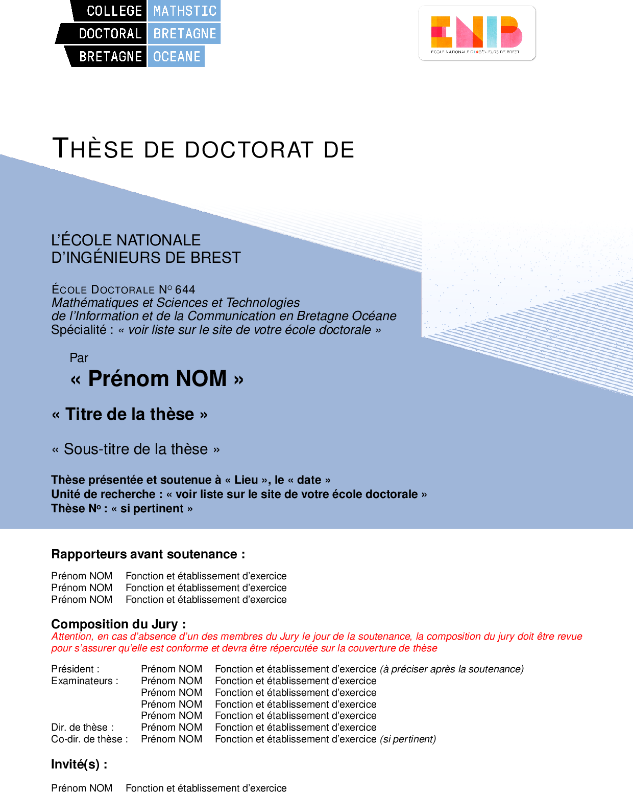
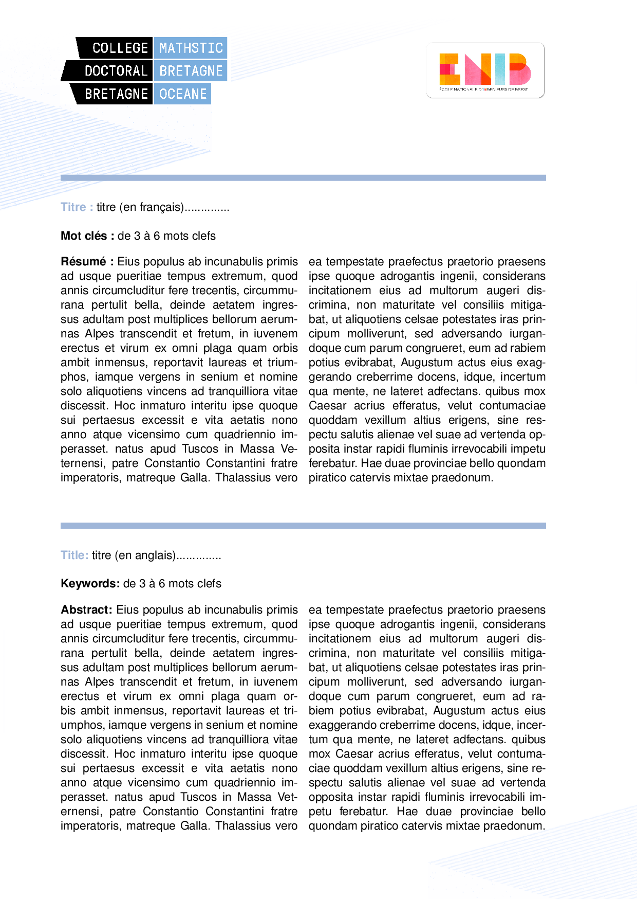
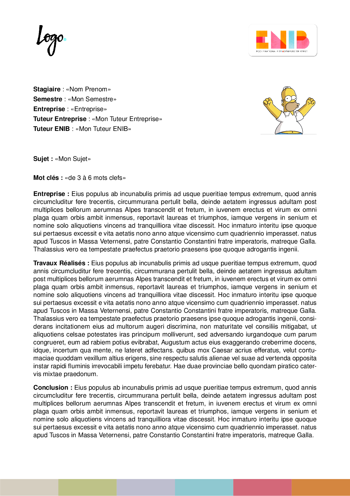

Latex Manuscripts 
=================

If you want to write some technical document (report, Ph.D. thesis), you can use a WYSIWYG program such as Word or the Latex language. On this page, I describe how to use the Latex language.

Install Latex
-------------

> Informations from: https://www.latex-project.org/get/

Many people use a cloud-based solution such as Overleaf to write Latex. This strategy can be great if you work with a research team, for example. However, before using a cloud-based solution, it is essential to know how to compile a Latex document using your local machine. To compile a Latex document, you need to install a Latex distribution.

Windows
+++++++

Check out the `MiKTeX <https://miktex.org/download>`_ or proTeXt or TeX Live distributions; they contain a complete TeX system with LaTeX itself and editors to write documents.

Mac OS
+++++++

The `MacTeX <https://www.tug.org/mactex/>`_ distribution contains everything you need, including a complete TeX system with LaTeX itself and editors to write documents.

Latex Editor 
------------

The MikTex or MacTex distributions already contain a Latex editor (TexWorks or TexShop). For large documents, you can also use a customized text editor. My preference goes for VSCode for this kind of stuff.

Templates
---------

I've created some templates for large document. These templates are mainly inspired from the superb gitlab `INRIA <https://gitlab.inria.fr/ed-mathstic/latex-template>`_ template.

* PhD template for the MathSTIC Doctoral School: https://github.com/vincentchoqueuse/MathSTIC_Latex_template

* Report Template for the ENIB students: https://github.com/vincentchoqueuse/ENIB_latex_template

.. image:: img/enib0.png
  :align: center
  :width: 30%
  :alt: Front Cover

Usage
+++++

To use a template,

1. Clone the github repo (git need to be installed on your local machine): 

.. code ::

    $ git clone https://github.com/vincentchoqueuse/ENIB_latex_template

2. Go to the cloned repo and then run :

.. code ::

    $ make pdf
